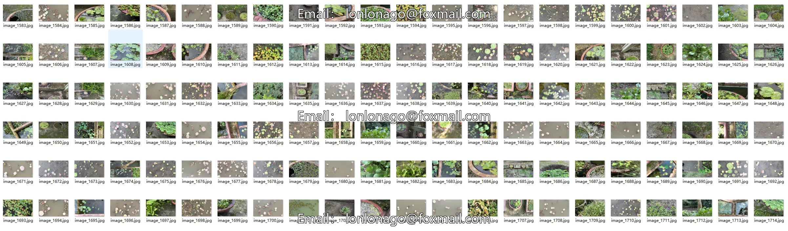
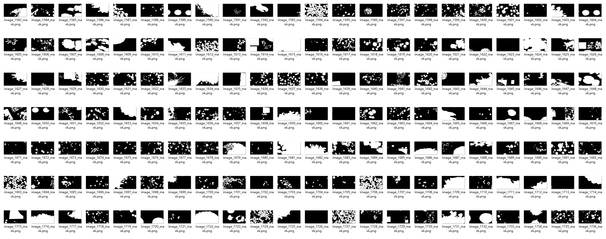
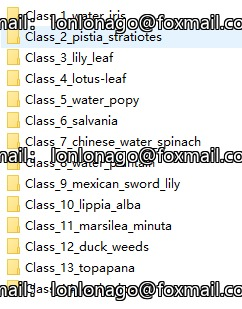
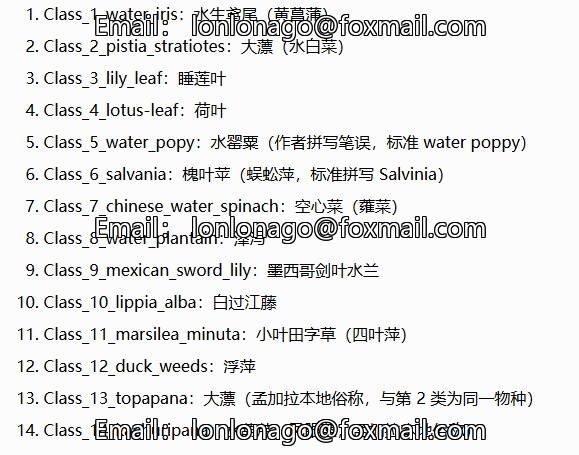
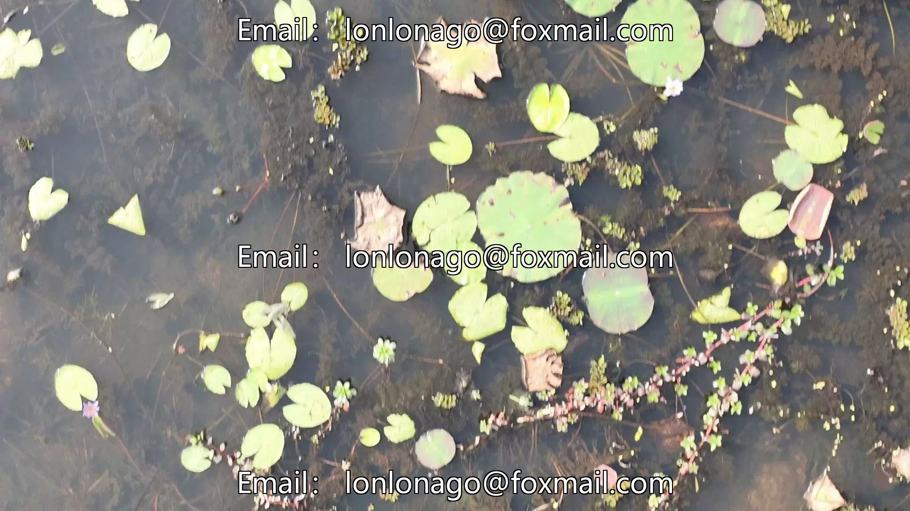
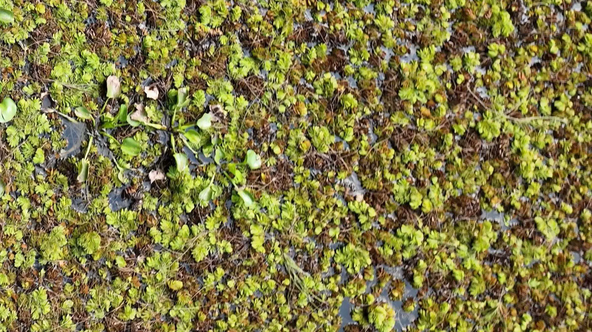

## Body

The aquatic plant dataset based on drones includes images of aquatic plants captured by drones in wetland ecosystems.

It supports tasks of semantic segmentation and classification. The segmented subset contains 1,761 image-mask pairs with pixel-level binary annotations, while the classified subset contains 1,468 cropped images for 14 species.

The images were captured under controlled conditions using DJI Mavic 4 Pro drones to ensure quality and consistency. The dataset is divided into training and testing sets, suitable for computer vision research in environmental monitoring, biodiversity analysis, and precision agriculture applications.

14 Species of Aquatic Plants
1. Class_1_water_iris: Water Iris
2. Class_2_pistia_stratiotes: Big Lily Pad
3. Class_3_lily_leaf: Water Lily Leaf
4. Class_4_lotus-leaf: Lotus Leaf
5. Class_5_water_popy: Water Poppy
6. Class_6_salvania: Salvadora Leaves
7. Class_7_chinese_water_spinach: Chinese Water Spinach
8. Class_8_water_plantain: Water Plantain
9. Class_9_mexican_sword_lily: Mexican Sword Lily
10. Class_10_lippia_alba: White Water Lily
11. Class_11_marsilea_minuta: Small-leaved Typha
12. Class_12_duck_weeds: Duck Weed
13. Class_13_topapana: Big Lily (Bengali local name, same as Class 2)
14. Class_14_kachuripana: Water Hyacinth (Fingernail Blue, Bengai local name)

## Images

Here is a pay link on Stripe ( https://buy.stripe.com/3cs8yP7sY87d0vu9AB ). Please contact me lonlonago@foxmail.com after funding $89, and I will send you a complete data files , thank you!

